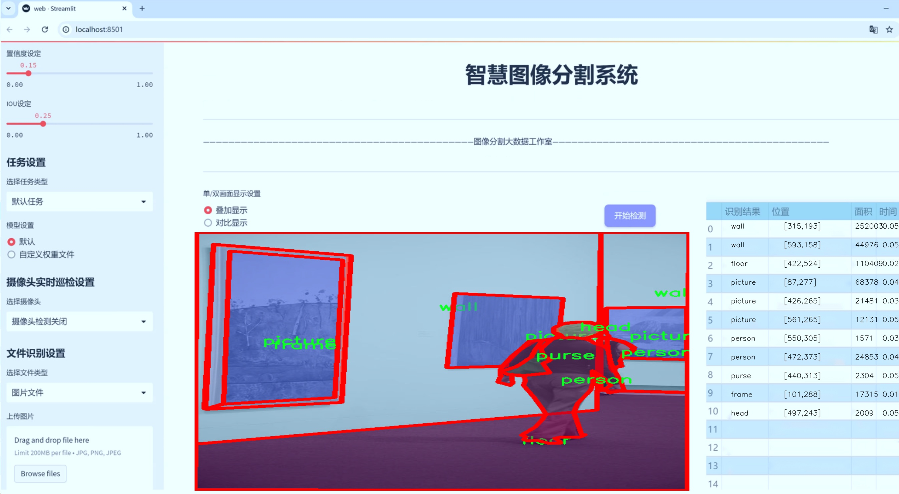
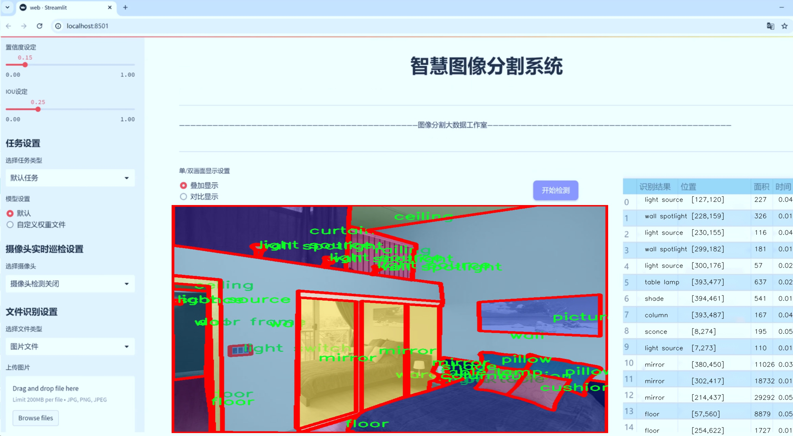
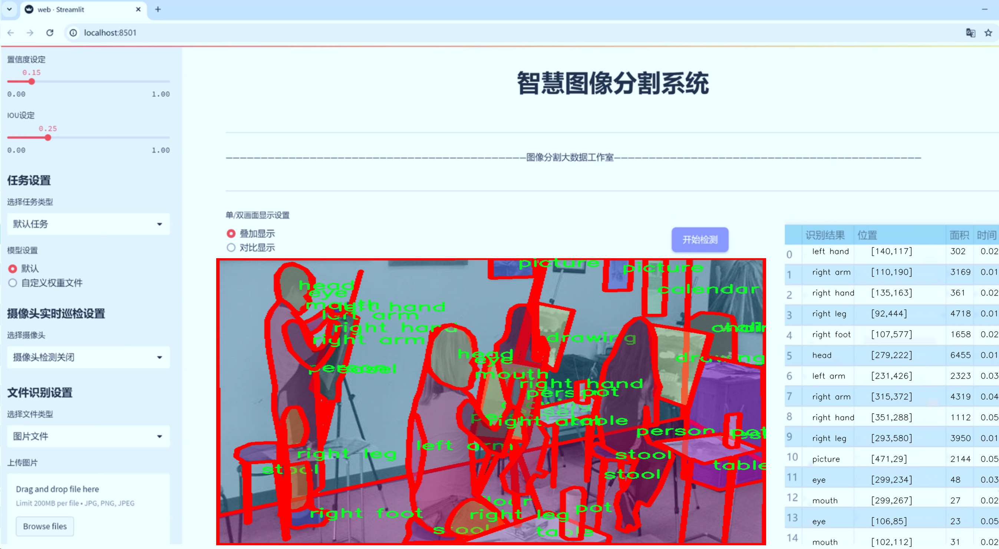
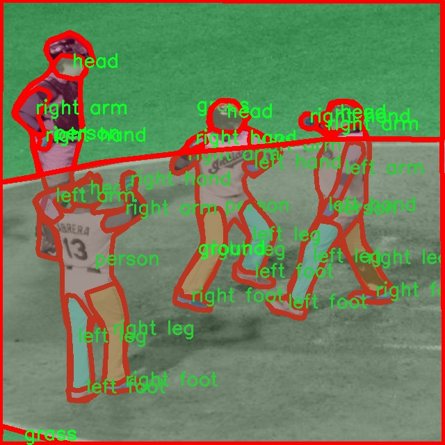
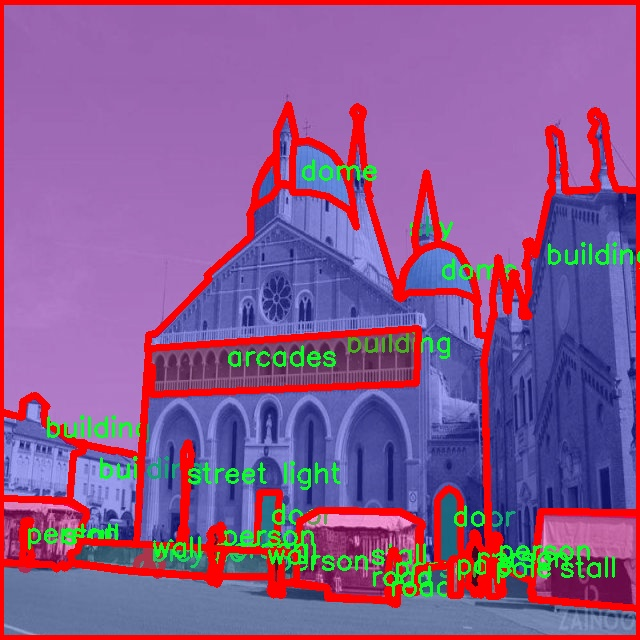
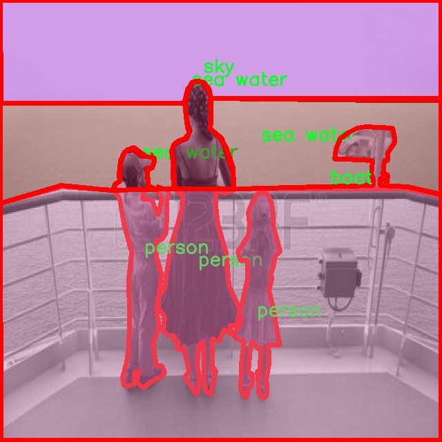
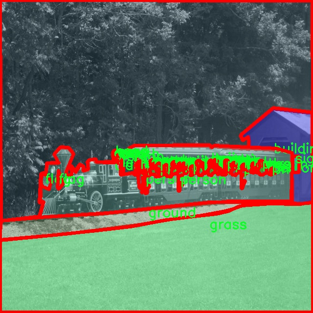
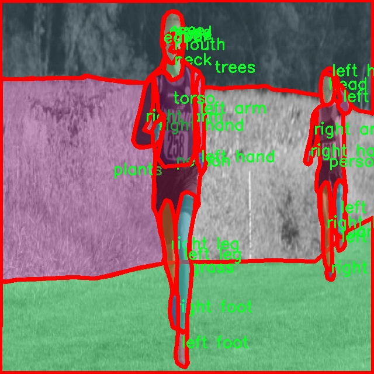

# 室内外场景物体分割系统源码＆数据集分享
 [yolov8-seg-C2f-EMBC＆yolov8-seg-efficientViT等50+全套改进创新点发刊_一键训练教程_Web前端展示]

### 1.研究背景与意义

项目参考[ILSVRC ImageNet Large Scale Visual Recognition Challenge](https://gitee.com/YOLOv8_YOLOv11_Segmentation_Studio/projects)

项目来源[AAAI Global Al lnnovation Contest](https://kdocs.cn/l/cszuIiCKVNis)

### 研究背景与意义

随着计算机视觉技术的快速发展，物体检测与分割在智能监控、自动驾驶、增强现实等领域的应用日益广泛。尤其是在室内外场景的物体分割中，准确识别和分割各种物体不仅能够提升系统的智能化水平，还能为用户提供更为直观和友好的交互体验。近年来，YOLO（You Only Look Once）系列模型因其高效的实时处理能力和良好的检测精度而受到广泛关注。YOLOv8作为该系列的最新版本，进一步优化了网络结构和算法，具备了更强的特征提取能力和更快的推理速度。然而，尽管YOLOv8在物体检测方面表现出色，但在复杂场景下的物体分割仍存在一定的挑战。

本研究旨在基于改进的YOLOv8模型，构建一个高效的室内外场景物体分割系统。该系统将利用一个包含9900张图像和364个类别的丰富数据集，涵盖了从家具、家电到交通工具等多种物体。这种多样化的类别设置使得模型能够在不同场景下进行有效的物体识别与分割，进而提升其在实际应用中的适用性和鲁棒性。通过对YOLOv8的改进，研究将重点关注如何提高模型在复杂背景下的分割精度，尤其是在物体重叠、遮挡以及光照变化等情况下的表现。

本研究的意义在于，通过改进YOLOv8，能够为物体分割领域提供新的思路和方法，推动智能视觉技术的发展。首先，室内外场景的物体分割在智能家居、智慧城市等应用中具有重要的实际价值。例如，在智能家居系统中，准确的物体分割可以实现对家庭环境的智能监控与管理；在智慧城市建设中，物体分割技术可以用于交通流量监测、公共安全管理等。其次，研究将为相关领域的学术研究提供新的数据集和模型，为后续的研究提供基础和参考。此外，基于YOLOv8的改进方案将为其他计算机视觉任务的研究提供借鉴，推动整个领域的技术进步。

综上所述，本研究不仅具有重要的理论价值，也具备广泛的应用前景。通过构建基于改进YOLOv8的室内外场景物体分割系统，能够有效提升物体分割的精度和效率，为智能视觉技术的进一步发展奠定基础。随着研究的深入，期望能够为相关领域的应用提供更为强大的技术支持，推动智能化社会的建设与发展。

### 2.图片演示







##### 注意：由于此博客编辑较早，上面“2.图片演示”和“3.视频演示”展示的系统图片或者视频可能为老版本，新版本在老版本的基础上升级如下：（实际效果以升级的新版本为准）

  （1）适配了YOLOV8的“目标检测”模型和“实例分割”模型，通过加载相应的权重（.pt）文件即可自适应加载模型。

  （2）支持“图片识别”、“视频识别”、“摄像头实时识别”三种识别模式。

  （3）支持“图片识别”、“视频识别”、“摄像头实时识别”三种识别结果保存导出，解决手动导出（容易卡顿出现爆内存）存在的问题，识别完自动保存结果并导出到tempDir中。

  （4）支持Web前端系统中的标题、背景图等自定义修改，后面提供修改教程。

  另外本项目提供训练的数据集和训练教程,暂不提供权重文件（best.pt）,需要您按照教程进行训练后实现图片演示和Web前端界面演示的效果。

### 3.视频演示

[3.1 视频演示](https://www.bilibili.com/video/BV1hdC2YPEq8/)

### 4.数据集信息展示

##### 4.1 本项目数据集详细数据（类别数＆类别名）

nc: 2399
names: ['abinet', 'acropolis', 'ad', 'advertisement', 'aer', 'aerial', 'air conditioning', 'air freshener', 'air vent', 'aircraft', 'aircraft carrier', 'airplane', 'airplanes', 'airport cart', 'alarm', 'alarm clock', 'algae', 'altar', 'altarpiece', 'amphitheater', 'anchor', 'andiron', 'animal', 'animals', 'antenna', 'antler', 'antlers', 'anvil', 'aperture', 'apple', 'apples', 'appliance', 'apron', 'aquarium', 'aqueduct', 'arc', 'arcade', 'arcade machine', 'arcade machines', 'arcades', 'arch', 'arm', 'arm panel', 'arm support', 'armchair', 'armor', 'armrest', 'art', 'art mannequin', 'articulated lamp', 'artificial golf green', 'ashtray', 'atm', 'autoclave', 'auxiliary trolley', 'awning', 'ax', 'baby carriage', 'baby chair', 'baby lion', 'baby walker', 'back', 'back control', 'back cushion', 'back pillow', 'backdrop', 'background', 'backp', 'backpack', 'backpacks', 'backplate', 'badge', 'badlands', 'badlands hills', 'bag', 'bags', 'balcony', 'balcony covered', 'ball', 'ball rack', 'ball storage', 'ballon', 'ballons', 'balloon', 'balloons', 'ballots', 'balls', 'baloons', 'balustrade', 'bananas', 'bandstand', 'banker', 'banner', 'banners', 'baptismal font', 'baptistry', 'bar', 'bar lift', 'barbecue', 'barbed wire', 'barbell', 'barn', 'barrel', 'barrel rack', 'barrels', 'barren land', 'barrier', 'bars', 'bascket', 'base', 'baseball', 'baseball field', 'baseball glove', 'baseboard', 'baseboards', 'basin', 'basket', 'basketball court', 'basketball hoop', 'baskets', 'bat', 'bathrobe', 'bathroom tiles', 'bathtub', 'batting cage', 'beam', 'beams', 'bear cutout', 'bear pum', 'bed', 'bed side', 'bed trolley', 'bedpost', 'beds', 'bedspread', 'bedspring', 'bee', 'beer machine', 'beer pump', 'bell', 'belt', 'belts', 'bench', 'benches', 'berbiqui', 'berth', 'bicycle', 'bicycle rack', 'bicycle racks', 'bicycles', 'bidet', 'bidon', 'big top', 'bilding', 'billboard', 'billiard table', 'binder', 'binders', 'binoculars', 'bird', 'birdcage', 'birds', 'blackboard', 'blade', 'blanket', 'blankets', 'blast furnace', 'bleachers', 'blender', 'blind', 'blinder', 'blinds', 'block', 'blocks', 'blouse', 'blusher brush', 'bmw', 'boar', 'board', 'boards', 'boat', 'boat stop', 'boat trolley', 'boats', 'body', 'boiler', 'bollard', 'bomb', 'bones', 'bonfire', 'bonsai tree', 'book', 'book stand', 'bookcase', 'bookend', 'books', 'bookstall', 'boot', 'booth', 'booths', 'boots', 'botijo', 'bottl', 'bottle', 'bottle pack', 'bottle rack', 'bottles', 'bottom rail', 'bouquet', 'bow', 'bow window', 'bowl', 'bowling alley', 'bowling alleys', 'bowling pins', 'bowls', 'box', 'box spring', 'boxes', 'boxing gloves', 'bracelet', 'bracelets', 'brake pedal', 'branch', 'branches', 'brand name', 'bread', 'bread basket', 'bread box', 'bread rolls', 'bread tray', 'breadbasket', 'breads', 'breaker box', 'breakwater', 'brick', 'bricks', 'bridge', 'bridges', 'briefcase', 'brochure', 'brochures', 'broom', 'brush', 'brushes', 'bucket', 'bud', 'buds', 'buffet', 'building', 'building arena', 'building materials', 'building ziggurat', 'buildings', 'bulb', 'bulbs', 'bull', 'bulldozer', 'bulletin board', 'bullring', 'bumper', 'bunch', 'bunch grapes', 'bunk bed', 'buns', 'buoy', 'buoys', 'burner', 'bus', 'bus station', 'bus stop', 'bush', 'bushes', 'butter', 'butterfly', 'buttocks', 'button', 'button panel', 'buttons', 'buttons panel', 'buttress', 'buzzer', 'cabin', 'cabine', 'cabinet', 'cabinetc', 'cabinets', 'cabins', 'cable', 'cable railway', 'cactus', 'caffee table', 'cage', 'cages', 'cake', 'cake mold', 'cakes', 'calculator', 'calendar', 'call buttons', 'camcorder', 'camel', 'camera', 'camouflage', 'can', 'can opener', 'canal', 'candelabra', 'candies', 'candle', 'candle holder', 'candles', 'candy', 'candy bags', 'candy track', 'cane', 'canes', 'canister', 'canlendar', 'cannon', 'canoe', 'canopy', 'cans', 'canvas', 'canyon', 'canyons', 'cap', 'cape', 'capital', 'car', 'car scrapping', 'car wreck', 'caravan', 'card', 'card display', 'card table', 'cards', 'cargo', 'carousel', 'carousel horse', 'carpet', 'carpets', 'carport', 'carriage', 'cars', 'cart', 'carts', 'cash register', 'casing', 'casing interior', 'casse', 'casserole', 'cassette', 'cassettes', 'castle', 'castle in ruins', 'cat', 'catamaran', 'catch', 'caterpillar', 'catwalk', 'cave', 'cave entrance', 'cd', 'cds', 'cds box', 'ceiling', 'ceiling fan', 'ceiling recessed light', 'ceiling s', 'ceiling spotlight', 'ceiling spotlights', 'cell', 'cell door', 'cell phone', 'cello cover', 'cells', 'cement', 'centerpiece', 'central reservation', 'ceramic box', 'ceramic hob', 'ceramic pot', 'ceramic ware', 'ceramics', 'cereal dispenser', 'chain', 'chainsaw', 'chair', 'chair desk', 'chair lift', 'chairr', 'chairs', 'chairs desk', 'chairs lift', 'chaise lounge', 'chalk', 'champagne bucket', 'chandelier', 'channel', 'channel water', 'check-in-desk', 'check-in-desks', 'checkers pieces', 'checkers table', 'cheese dish', 'ches table', 'chess', 'chess table', 'chest', 'chest of drawers', 'chicken', 'childish games', 'chimney', 'chinese lantern', 'chocolates', 'christmas lights', 'christmas tree', 'circular saw', 'cistern', 'city', 'clamp', 'clamp lamp', 'clay', 'cliff', 'cliffs', 'climber person', 'climbing frame', 'clip', 'clipboard', 'cloak', 'clock', 'clock face', 'clock radio', 'clocks', 'closet', 'closet rod', 'closure', 'cloth', 'clothes', 'clothes hanging', 'clothes rack', 'clothesline', 'clothespin', 'clothing', 'cloud', 'clouds', 'cloudy sky', 'club', 'clubs', 'clutch pedal', 'coast', 'coaster', 'coasters', 'coat', 'coat of arms', 'coat rack', 'cobbles', 'cockpit', 'cockpot', 'coffee', 'coffee cup', 'coffee grinder', 'coffee maker', 'coffee pot', 'coffee table', 'coffin', 'cold storage', 'cold storage door', 'cold store', 'column', 'columns', 'comforter', 'computer', 'computer case', 'confessional booth', 'console table', 'construction equipment', 'contact lens case', 'container', 'containers', 'control', 'control cabinet', 'control panel', 'control table', 'control tower', 'controls', 'conveyor belt', 'cooker', 'cookies', 'cool box', 'cooler', 'coop', 'copper vessel', 'coral', 'cord', 'cork', 'corkscrew', 'corner pocket', 'cornice', 'counter', 'counters', 'countertop', 'court', 'cove', 'cover', 'cover curtain', 'covered bridge', 'covered wagon', 'cow', 'cowbell', 'cows', 'cpu', 'crackers', 'cradle', 'crafts', 'crane', 'crane truck', 'cranes', 'crate', 'crater', 'crates', 'cream', 'creamer', 'creek', 'creeper', 'crevasse', 'crock', 'crock pot', 'cross', 'crosses', 'crosswalk', 'cruet', 'crutch', 'cube', 'cubicle', 'cubicles', 'cue', 'cue rack', 'cues', 'cumputer', 'cup', 'cups', 'curb', 'curb cut', 'curtain', 'curtain cover', 'curtain rod', 'curtain support', 'curtains', 'cushion', 'cushions', 'cut slices machine', 'cut table', 'cutlery', 'cutting board', 'cyclotron', 'dam', 'dartboard', 'dashboard', 'debris', 'deck', 'deck chair', 'deck chairs', 'decor', 'decoration', 'decorations', 'decorative glass', 'deer antler', 'dental chair', 'dental swivel chair', 'desert', 'desert ground', 'desk', 'desk chair', 'desk lamp', 'desk mat', 'desk organizer', 'desks', 'detergent dispenser', 'developing machine', 'dial', 'dice', 'diffuser', 'diffusor', 'digital clock', 'diploma', 'directory', 'dirt track', 'dish', 'dish drainer', 'dish rack', 'dish soap', 'dish towel', 'dishcloth', 'dishes', 'dishrack', 'dishwasher', 'disk spindle', 'dispenser', 'display', 'display board', 'divider', 'diving board', 'division', 'dock', 'docks', 'dog', 'dog bed', 'dog dish', 'dog feeder', 'doll', 'dollhouse', 'dolphin', 'dome', 'doo', 'door', 'door bars', 'door frame', 'doors', 'doort', 'dormer', 'double door', 'drain', 'drain pipe', 'drain vent', 'drawer', 'drawing', 'drawing board', 'dress', 'dresser', 'dresses', 'dressing screen', 'dressing table', 'drill', 'drill bits', 'drinking fountain', 'drom', 'drum', 'drums', 'dry dock', 'duck', 'dumbbell', 'dumbbells', 'dummy', 'dune', 'dunes', 'dustpan', 'duvet', 'dvd', 'dvd box', 'dvd player', 'dvds', 'dvds box', 'dvds rack', 'dve', 'dye', 'ear', 'earmuffs', 'earphones', 'earrings', 'earthenware jar', 'easel', 'eat', 'eaves', 'egg', 'egg cup', 'egg tray', 'eggs', 'electric cable', 'electric toothbrush', 'electrical plant', 'electricity box', 'electricity meter', 'elephant', 'elevator', 'elevator door', 'embankment', 'ember', 'embrasure', 'engine', 'entrance', 'entrance parking', 'entry phone', 'envelope', 'envelopes', 'equipment', 'escalator', 'escarpment', 'excavator', 'exercise bench', 'exercise bike', 'exercise machine', 'exhaust pipe', 'exhi', 'exhibitor', 'external driver', 'external drivers', 'extractor fan', 'extractor hood', 'extractor pipe', 'eye', 'eyeglasses', 'fabric', 'face', 'factory', 'fairground ride', 'fan', 'faucet', 'fax machine', 'feeder', 'feeding trough', 'fence', 'fences', 'fende', 'fender', 'fenders', 'ferris wheel', 'field', 'figure', 'figurine', 'file', 'file box', 'file cabinet', 'file cabinets', 'filing cabinet', 'filter', 'finger', 'fire', 'fire alarm', 'fire blanket', 'fire engine', 'fire escape', 'fire extinguisher', 'fire hydrant', 'fireplace', 'fireplace utensils', 'firewood', 'fish', 'fish farm water', 'fish tank', 'fitting room', 'flag', 'flag pole', 'flags', 'flame', 'flask', 'flight deck', 'flip flop', 'float', 'floatation device', 'flock of sheep', 'floe', 'floodlight', 'floodlights', 'floor', 'floor lamp', 'floor light', 'floor recessed light', 'floor spotlight', 'floot', 'flower', 'flowerpot', 'flowers', 'flowrs', 'fluorescent', 'fluorescent tube', 'fluorescent tubes', 'fluorescet tube', 'flush mount light', 'flusher', 'flyscreen', 'foal', 'foam', 'fog bank', 'folder', 'folders', 'folding chair', 'folding chairs', 'folding door', 'folding doors', 'folding screen', 'foliage', 'font', 'food', 'food processor', 'foot', 'foot rest', 'football', 'football stadium', 'footboard', 'footbridge', 'footpath', 'footrest', 'forecourt', 'forest', 'fork', 'forklift', 'forks', 'fort', 'fountain', 'frame', 'freezing ground', 'freight goods', 'fringe', 'front', 'fruit', 'fruit bowl', 'fruit stand', 'fruits', 'fryer', 'fryer basket', 'frying pan', 'frying pans', 'fuel station', 'fumes', 'funfair', 'funnel', 'furnace room', 'fuselage', 'gable', 'game', 'game table', 'games', 'games room', 'games table', 'gangway', 'garage', 'garage door', 'garage doors', 'garbage', 'garden', 'garland', 'garlic', 'garlics', 'garment bag', 'gas bottle', 'gas cap', 'gas cylinder', 'gas heater', 'gas pedal', 'gas station', 'gasworks', 'gate', 'gates', 'gauge', 'gaze', 'gazebo', 'gear', 'gearshift', 'girder', 'glacier', 'glass', 'glass box', 'glass separation', 'glasses', 'gliue', 'globe', 'glove', 'gloves', 'glue', 'goal', 'goblet', 'golf bag', 'golf ball', 'golf cart', 'golf club', 'golf green', 'golfer', 'gondola', 'gramophone', 'grand piano', 'grandfather clock', 'grandstand', 'grapes', 'grapevine', 'grass', 'grass field', 'grassland', 'grating', 'graund', 'gravel', 'gravy boat', 'greenhouse', 'grill', 'grille', 'grille door', 'grinder', 'gripper', 'ground', 'ground desert', 'ground sand', 'grpimd', 'guardhouse', 'guitar', 'guitar cover', 'gull', 'gun', 'gutter', 'h-stretcher', 'hair', 'hair dryer', 'hair spray', 'hairbrush', 'hairdresser chair', 'hairpieces', 'half globe', 'half moon', 'hammer', 'hammock', 'hand', 'hand bellows', 'handbag', 'handle', 'handlebar', 'handrail', 'handrair', 'hanger', 'hangers', 'hanging clothes', 'hanging instrument', 'hanging utensils', 'hard drive', 'harness', 'harp', 'hat', 'hatchery', 'hats', 'haversack', 'hay roll', 'hay stacks', 'head', 'head jamb', 'head rail', 'headboard', 'headlight', 'headphones', 'headstone', 'headstone cross', 'headstones', 'heart', 'hearth', 'heater', 'hedge', 'hedge partial', 'heel shoe', 'helic', 'helicopter', 'heliport', 'helmet', 'hen', 'hen house', 'henhouse', 'herb', 'highlight', 'hill', 'hills', 'hillside', 'hinge', 'hip tiles', 'hoarding', 'hockey rink', 'hockey table', 'hoe', 'hole', 'hole puncher', 'hood', 'hook', 'hoop', 'horn', 'horse', 'hose', 'hot air balloon', 'hot mitt', 'hot tub', 'hotplate', 'hourglass', 'house', 'house number', 'houses', 'housing', 'housing project', 'howdah', 'hull', 'hut', 'huts', 'ice', 'ice bucket', 'ice cone', 'ice cream machine', 'ice field', 'ice floe', 'ice ground', 'ice hockey rink', 'ice maker', 'ice mountain', 'ice rink', 'ice shelf', 'iceberg', 'icicle', 'icicles', 'id card', 'idol', 'igloo', 'incinerator', 'industrial machine', 'industry', 'inflatable bounce game', 'inflatable glove', 'inflatable park', 'inflatable toy', 'inside arm', 'instrument', 'instrument panel', 'interior casing', 'ipod', 'iron', 'iron bar', 'iron cross', 'iron po', 'iron pot', 'ironing board', 'island', 'islet', 'jack', 'jacket', 'jackets', 'jam', 'jamb', 'jar', 'jars', 'jetty', 'jewelry display', 'joist', 'joists', 'joystick', 'judge table', 'jug', 'juice machine', 'juke box', 'junk', 'kayak', 'kennels', 'kettle', 'key', 'keyboaard', 'keyboard', 'keyboards', 'keys', 'killer whale', 'kiosk', 'kitchen', 'kitchen island', 'kitchen towel', 'kitchen utensils', 'kite', 'knife', 'knife set', 'knives', 'knob', 'knobs', 'lab bench', 'label', 'label tag', 'laboratory equipment', 'laboratory machine', 'labyrinth', 'ladder', 'ladle', 'lagoon', 'lake', 'lamp', 'lamp housing', 'lamp post', 'land', 'landfill', 'landing gear', 'landing track', 'landing tracks', 'lantern', 'lanterns', 'laptop', 'large rabbit', 'latch', 'lathe', 'lattice', 'laundry', 'laundry basket', 'lava', 'leaf', 'leash', 'leather', 'leave', 'leaves', 'lectern', 'ledge', 'left arm', 'left foot', 'left hand', 'left leg', 'left shoulder', 'leg', 'legs', 'lemon', 'level', 'license plate', 'lid', 'light', 'light display', 'light house', 'light pole', 'light post', 'light sosurce', 'light source', 'light sw', 'light switch', 'light switches', 'light tower', 'light troffer', 'lighter', 'lighthouse', 'lighting', 'lights', 'lion', 'lithograph', 'litter basket', 'lock', 'locker', 'lockers', 'locomotive', 'lodge', 'loft', 'log', 'logo', 'logs', 'loom', 'loudspeaker', 'lower deck', 'lower sash', 'luggage', 'luggage rack', 'lumps', 'machine', 'machine gun', 'machinery', 'machines', 'magazine', 'magazine rack', 'magazines', 'magnifying glass', 'mailbox', 'makeup', 'mallet', 'manchette', 'manhole', 'manometer', 'mantle', 'mantle piece', 'manufacturing plant', 'map', 'maps', 'marker', 'marking pens', 'marsh water', 'mask', 'massage bed', 'mast', 'mat', 'matchbox', 'material', 'material rolls', 'materials', 'mattress', 'mausoleum', 'measurer', 'measuring spoons', 'meat', 'mechanical shovel', 'mechanism', 'menu', 'menu card', 'merchandise', 'merry-go-round', 'mesh guard rail', 'message board', 'metal piping', 'metal shutter', 'metal shutters', 'meter', 'meter box', 'meters', 'mezzanine', 'microph', 'microphone', 'microscope', 'microw', 'microwave', 'milestone', 'milk jug', 'mill', 'mine', 'miniature chair', 'miniature sofa', 'mirror', 'mirrors', 'missile', 'mitra', 'mitten', 'mixer', 'mobile', 'mobile conveyor', 'mobile home', 'models', 'modern art', 'molding', 'money', 'monitor', 'monitors', 'monolith', 'monument', 'moon', 'moon dial', 'mop', 'mosque', 'moss', 'motion detector', 'motor', 'motorbike', 'motorbikes', 'motorboat', 'moulding', 'mound', 'mountain', 'mountain ledge', 'mountain pass', 'mountain salt', 'mountains', 'mouse', 'mouse stand', 'mousepad', 'mouth', 'movie poster', 'moving walkway', 'mug', 'mugs', 'multiple socket', 'muntin', 'mural', 'mushroom', 'music box', 'music machine', 'music stand', 'music system', 'musicians place', 'mustache', 'nail brush', 'name', 'name plate', 'names', 'napkin', 'napkin holder', 'napkin rack', 'napkin ring', 'napkins', 'nbench', 'neck', 'necklace', 'necklaces', 'nest', 'net', 'newspaper', 'newspaper rack', 'newspaper stand', 'newspapers', 'niche', 'night light', 'night table', 'nordic comforter', 'nose', 'note', 'notebokk', 'notebook', 'notebooks', 'notecards', 'notepad', 'notes', 'notice', 'notice board', 'nuclear reactor', 'number', 'nuts', 'oar', 'obelisk', 'observation tower', 'observatory', 'obstacle', 'office', 'office partition', 'office window', 'offices', 'oil jar', 'oil lamp', 'oil tube', 'oilcloth', 'oilfield', 'oni', 'onion', 'onions', 'opening', 'orange', 'oranges', 'orchard', 'organ', 'organizer', 'ornament', 'ornaments', 'ottoman', 'outet', 'outlet', 'outside arm', 'oven', 'overflot plate', 'overhang', 'overpass', 'oxygen tank', 'oyster bank', 'oytlet', 'paath', 'pack', 'pack bags', 'package', 'packages', 'packet', 'packets', 'packs', 'paddle', 'paddles', 'padlock', 'pagoda', 'paint brush', 'paint brushes', 'paintbrush', 'painting', 'paintings', 'pala', 'palette', 'palisade', 'pallet', 'pallets', 'palm tree', 'palm trees', 'pan', 'pane', 'panel', 'panels', 'pans', 'pant', 'pantheon', 'pantry', 'pants', 'paper', 'paper cup', 'paper cups', 'paper filer', 'paper napkin', 'paper r', 'paper rack', 'paper roll', 'paper rolls', 'paper towels', 'paper weight', 'papers', 'papr cup', 'park', 'parking', 'parking entrance', 'parking lot', 'parking meter', 'parking place', 'parterre', 'paslm tree', 'pastries', 'path', 'patio', 'pavilion', 'paving stone', 'peach', 'pedal', 'pedestal', 'pelt', 'pelts', 'pen', 'pen set', 'pencil', 'pencil case', 'pencil sharpener', 'pencils', 'pendant', 'pendant lamp', 'pendant lamps', 'pendulum', 'penguin', 'pens', 'people', 'pepper', 'pepper shaker', 'pergola', 'person', 'person swimming', 'persoon', 'pet dish', 'petal', 'petrol pump', 'petrol pumps', 'phonends', 'photo', 'photo album', 'photo backdrops', 'photo machine', 'photocopier', 'piano', 'piano pedals', 'picnic spot', 'picture', 'pictures', 'pier', 'pig', 'pigeonhole', 'pile of trash', 'pillar', 'pillow', 'pilon', 'pilot cockpit', 'pinball', 'pine decor', 'pine decoration', 'pineapple', 'pinecone', 'pinecones', 'ping pong paddle', 'pipe', 'pipeline', 'pipes', 'piston', 'pit', 'pitch', 'pitcher', 'piture', 'placard', 'place mat', 'place mats', 'place setting', 'plae', 'plane', 'planer', 'plank', 'planks', 'plans', 'plant', 'plant box', 'plant por', 'plant pot', 'plant pots', 'plant tree', 'plantas', 'planter', 'plants', 'plants pot', 'plaque', 'plastic', 'plastic bottles', 'plastic cup', 'plate', 'plate mat', 'plate rack', 'plateau', 'plates', 'platform', 'plats', 'platter', 'playground', 'playground equipment', 'pliers', 'plug', 'podium', 'poker', 'pole', 'pole sign', 'poles', 'pond', 'pond water', 'pool', 'pool ball', 'pool balls', 'pool bass', 'porch', 'porch rail', 'porexpan board', 'pork', 'port', 'portable fridge', 'post', 'post light', 'post-it', 'postal card', 'postbox', 'postcard', 'poster', 'poster board', 'posters', 'pot', 'pot holder', 'pot pen', 'pot rack', 'potatoes', 'pots', 'potted fern', 'pottery', 'potty', 'power', 'power box', 'power line', 'power lines', 'power point', 'press', 'pressure cooker', 'price list', 'price tag', 'printer', 'projection screen', 'projector', 'propeller', 'protective railing', 'puddle', 'puff', 'pulley', 'pulpit', 'pumpkin', 'pumpkins', 'punching bag', 'purse', 'puzzle', 'pyjamas', 'pylon', 'pyramid', 'quay', 'quicksand', 'quilt', 'rabbit', 'racetrack', 'rack', 'rack cue', 'racket', 'radar', 'radiator', 'radio', 'raft', 'rafting', 'rail', 'railing', 'railings', 'railroad', 'railroad track', 'railroad train', 'rails', 'railway', 'railway engine', 'railway yard', 'railways', 'rain drain', 'rainbow', 'rake', 'rakes', 'ramp', 'ranch', 'range', 'ray', 'razor cut hair', 'receiver', 'reclining chair', 'record player', 'recorder', 'recycling bin', 'recycling materials', 'recycling plant', 'recycling trash', 'refinery', 'refrigerator', 'refuge', 'remote control', 'rescue float', 'restroom', 'revolving door', 'revolving doors', 'riad', 'ribbon', 'ride', 'ride structure', 'ridge tiles', 'rifle', 'right arm', 'right foot', 'right hand', 'right leg', 'right shoulder', 'rim', 'ring', 'ring binder', 'riser', 'river', 'river water', 'riverside', 'road', 'roadroller', 'roads', 'rock', 'rocker', 'rocking', 'rocking chair', 'rocking horse', 'rocks', 'rocky formation', 'rocky formations', 'rocky ground', 'rocky wall', 'rod', 'roll', 'roller coaster', 'roller coaster cars', 'rolls', 'roof', 'roof rack', 'root', 'rop', 'rope', 'rope bridge', 'ropes', 'rose window', 'rotisserie', 'roundabout', 'router', 'rowing', 'rowing boat', 'rubber boat', 'rubber ring', 'rubbish dump', 'rubble', 'rudder', 'rug', 'ruins', 'rule', 'rung', 'runnel water', 'runner cloth', 'running track', 'runway', 'runway strip', 'sack', 'sacks', 'sacks wall', 'saddle', 'sade', 'safe', 'safes', 'safety belt', 'safety net', 'safety rail', 'safety side', 'safety suit', 'sail', 'sailboat', 'saline solution', 'salt', 'salt marsh', 'salt plain', 'salt shaker', 'saltcellar', 'sand', 'sand beach', 'sand dune', 'sand dunes', 'sand trap', 'sandal', 'sandbar', 'sandbox', 'sandpit', 'sandwich', 'santa claus', 'sash', 'sash lock', 'satellite dish', 'saucepan', 'sausage', 'sausages', 'savanna', 'saw', 'saxophone', 'scaffolding', 'scales', 'scanner', 'scarf', 'scarfs', 'schoo desk', 'school desk', 'schoolyard', 'scissors', 'sconce', 'score', 'scoreboard', 'scotch tape', 'scourer', 'scraper', 'screen', 'screen stand', 'screw', 'screwdrivers', 'scrub', 'scrubland', 'scrubs', 'sculpture', 'sculpture of the globe', 'sculptures', 'scyscraper', 'sea', 'sea water', 'seagull', 'seaplane', 'seat', 'seat base', 'seat belt', 'seat cushion', 'seating', 'seats', 'secateurs', 'secretary table', 'security camera', 'security checkpoint', 'security door', 'security door frame', 'seedbed', 'seesaw', 'seltzer bottle', 'semi-flush mount light', 'semidesert ground', 'separator', 'service elevator', 'service station', 'set of instruments', 'set of pigeonholes', 'set office', 'sewer', 'sewing box', 'sewing machine', 'shack', 'shacks', 'shade', 'shade translucent', 'shaft', 'shaker', 'shanties', 'shanty', 'shantytown', 'shape', 'shavings', 'shawl', 'shed', 'sheep', 'sheep pen', 'sheet', 'shelf', 'shell', 'shelter', 'shelves', 'shield', 'ship', 'shipyard', 'shirt', 'shirts', 'shoe', 'shoes', 'shoji screen', 'shop', 'shop window', 'shopping cart', 'shops', 'shore', 'shorts', 'shoulder', 'shovel', 'show', 'showc', 'showcase', 'shower', 'shower curtain', 'shower door', 'shower faucet', 'shower head', 'shower room', 'shower screen', 'shower shelf', 'shower stall', 'shower tray', 'shrub', 'shrubs', 'shutter', 'shutters', 'side', 'side jamb', 'side pocket', 'side rail', 'side table', 'sideboard', 'sidewalk', 'sidewalk cafe', 'sign', 'sign ballon', 'signs', 'sill', 'silo', 'silos', 'silver bird statue', 'silver canister', 'sink', 'sinkhole', 'sinkhole water', 'sinks', 'siphon', 'site hut', 'skate', 'skateboard', 'skating rink', 'skeleton', 'ski', 'ski lift', 'ski lift pole', 'ski slope', 'ski trail', 'skids', 'skimmer', 'skip', 'skirt', 'skirting board', 'skirts', 'skis', 'skittle', 'skittle alley', 'skittle alleys', 'skittles', 'skjy', 'skull', 'sky', 'sky scraper', 'sky scrapers', 'skylight', 'skyscraper', 'skyscrapers', 'skywalk', 'slates', 'slats', 'sled', 'sleeping robe', 'slice', 'slide', 'sliding', 'sliding door', 'slipper', 'slippers', 'slope', 'slot machine', 'slot machines', 'slotted spoon', 'small table', 'smoke', 'smoke detector', 'smoke escape', 'sneaker', 'sneakers', 'snow', 'snow covered ground', 'snow covered plain', 'snow track', 'snowboard', 'snowshoe', 'snowy', 'snowy ground', 'snowy mountain pass', 'snowy trees', 'soap', 'soap bottle', 'soap dish', 'soap dispenser', 'soccer ball', 'socket', 'sockets', 'socks', 'sofa', 'sofa bed', 'solar panel', 'spade', 'spanner', 'spanners', 'spatula', 'speaker', 'special shape', 'spectacle-case', 'speedway', 'sphere', 'spice', 'spice rack', 'spices', 'spindle', 'sping', 'spiral staircase', 'spire', 'sponge', 'spoo', 'spoon', 'spoons', 'sport bag', 'sports bag', 'spotlight', 'spotlights', 'spout', 'spray', 'spray bottle', 'spread', 'sprinkler', 'square', 'squash', 'squeezer', 'stabilizer', 'stables', 'stage', 'stagelight', 'stained glass', 'stained-glass window', 'staircase', 'stairs', 'stake', 'stalactite', 'stalactites', 'stalagmite', 'stalagmites', 'stall', 'stalls', 'stand', 'stands', 'stapler', 'star', 'starfish', 'stationary bicycle', 'statue', 'statue piller', 'stave', 'steam room', 'steam shovel', 'steamroller', 'steel', 'steel chair', 'steel industry', 'steeple', 'steering wheel', 'stem', 'step', 'steps', 'steps machine', 'stereo', 'stick', 'sticker', 'sticks', 'sticky tape dispenser', 'stile', 'stocking', 'stockings', 'stone', 'stone ball', 'stone path', 'stone slab', 'stone wall', 'stones', 'stones beach', 'stones wall', 'stool', 'stools', 'stopper', 'storage', 'storage jar', 'storage rack', 'storm drain', 'storm grate', 'stove', 'strainer', 'straw', 'straw bale', 'straw bales', 'straws', 'street box', 'street grate', 'street light', 'street lights', 'street market', 'street number', 'street sign', 'streetlight', 'stretcher', 'string', 'stringer', 'strip light', 'stripe', 'strips', 'strongbox', 'strongroom', 'structure', 'stuffed animal head', 'stuffed bird', 'stuffed head', 'stump', 'stumps', 'sty', 'submarine', 'subway', 'sugar bowl', 'suit hanger', 'suitcase', 'suitcases', 'sulfur mine', 'sun', 'sun deck', 'sunflowers field', 'supplies', 'support', 'support beam', 'support pole', 'surfboard', 'suspension bridge', 'suspension rope bridge', 'swamp', 'swan', 'swatshirt', 'sweater', 'sweaters', 'sweatshirt', 'sweatshirts', 'sweet', 'sweets', 'swimming pool', 'swimming pool ladder', 'swing', 'swinging seat', 'swings', 'switch', 'switch box', 'switches', 'swivel chair', 'swmming pool', 'swmming pool lader', 'sword', 'synthesizer', 't-shirt', 't-shirts', 'table', 'table cloth', 'table football', 'table game', 'table lamp', 'table runner', 'table tenis', 'table tennis', 'tablecloth', 'tableland', 'tables', 'tail', 'taillight', 'tank', 'tank lid', 'tanks', 'tap', 'tap wrench', 'tape', 'taper', 'tapestry', 'target', 'tarmac', 'tarp', 'tarpaulin', 'tassle', 'teacup', 'teapot', 'teddy', 'teddy bear', 'teeth', 'telegraph pole', 'telepho', 'telephone', 'telephone booth', 'telephone directories', 'telescope', 'television', 'television camera', 'television stand', 'temple', 'tennis court', 'tensiometer', 'tent', 'tents', 'terminal', 'terrace', 'terrace cafe', 'terraces', 'test', 'test tube', 'test tubes', 'text', 'textiles', 'thermometer', 'thermos', 'thermostat', 'threads', 'throne', 'throw', 'ticket booth', 'ticket counter', 'ticket office', 'ticket vending machine', 'ticket window', 'tie', 'ties', 'tiger', 'tile', 'tiles', 'till', 'tin', 'tin box', 'tins', 'tinsel', 'tire', 'tires', 'tissue', 'tissue box', 'toaster', 'toaster oven', 'toe board', 'toilet', 'toilet brush', 'toilet paper', 'toilet paper holder', 'toilete kit', 'toll booth', 'toll gate', 'toll plaza', 'tomato', 'tomatoes', 'tomb', 'tombs', 'tombstone', 'tombstones', 'tongs', 'tongue', 'tool', 'tool kit', 'toolbox', 'tools', 'toothbrush', 'toothpaste', 'top', 'topiary tree', 'torch', 'torchiere lamp', 'torrent water', 'torso', 'tortoise', 'towel', 'towel dispenser', 'towel paper', 'towel rack', 'towel radiator', 'towel rail', 'towel ring', 'towels', 'tower', 'toy', 'toys', 'track', 'tracks', 'tractor', 'traffic cone', 'traffic cones', 'traffic light', 'traffic lights', 'trailer', 'trailers', 'train', 'train track', 'train tracks', 'training potty', 'tramway', 'transformer', 'trash', 'trash bag', 'trash can', 'tray', 'trays', 'tread', 'treadmill', 'treadmills', 'tree', 'tree trunk', 'tree trunks', 'trees', 'trellis', 'trench', 'trestle', 'triangle', 'tricycle', 'tripod', 'troller bin', 'trolley', 'trolley basket', 'trolley crane', 'trolley drawers', 'trolley table', 'trolley tray', 'trolly', 'trophy', 'trough', 'trousers', 'truck', 'truck crane', 'truckle bed', 'trucks', 'truk', 'trunk', 'trunks', 'tube', 'tubing', 'tumble dryer', 'tundra', 'tunnel', 'tupper', 'turbine engine', 'tureen', 'turnbuckle', 'turntables', 'turtle', 'typewriter', 'tyrees', 'umbrella', 'umbrella stand', 'umbrellas', 'undergrowth', 'underpass', 'units', 'upper sash', 'urban valley', 'urbanization', 'urinal', 'urn', 'utensils', 'utensils canister', 'vacuum cleaner', 'valance', 'valley', 'valve', 'van', 'vane', 'vanity', 'vanity bag', 'vase', 'vases', 'vasse', 'vault', 'vcr', 'vegetables', 'veil', 'vending machine', 'vent', 'ventilation shaft', 'veranda awning', 'verandah', 'vessel', 'vest', 'viaduct', 'video', 'video camera', 'videos', 'viewpoint', 'village', 'vine', 'vine shoot', 'vinegar jar', 'vineyard', 'vintage bottle filler', 'violin', 'violoncello', 'visor', 'volleyball court', 'voting booth', 'voting instructions', 'wagon', 'wagons', 'wall', 'wall clock', 'wall recessed light', 'wall spotlight', 'wall spotlights', 'wallet', 'walnuts', 'walrus', 'wann', 'wardrobe', 'warehouse', 'warship', 'washbasin chair', 'washing hair', 'washing machine', 'washing machines', 'watch', 'watchtower', 'water', 'water bell', 'water bog', 'water can', 'water chute', 'water cooler', 'water dispenser', 'water ditch', 'water fountain', 'water hole', 'water lily', 'water machine', 'water mill', 'water mist', 'water spurt', 'water surf', 'water tank', 'water tower', 'water vapor', 'water weel', 'water wheel', 'watercraft', 'waterfall', 'watering can', 'watermelon', 'waterscape', 'waterway', 'wave', 'wave splash', 'weapon', 'weapons', 'webcam', 'weeds', 'weighbridge', 'weights', 'well', 'wetland', 'wheel', 'wheelbarrow', 'wheelchair', 'wheelhouse', 'wheels', 'whisk', 'white board', 'whitewater', 'wicker basket', 'wig', 'winch', 'windmill', 'window', 'window latch', 'window scarf', 'windows', 'windshield', 'windwo', 'wine rack', 'wing', 'wing wall', 'wiper', 'wire', 'wireless phone', 'wires', 'witness stand', 'wok', 'wood', 'wood board', 'wood box', 'wood figure', 'wood stove', 'woodcarving', 'work coat', 'work surface', 'work table', 'workbench', 'wreath', 'wrenches', 'writing desk', 'wsall', 'xxx', 'zebra', 'ziggurat']


##### 4.2 本项目数据集信息介绍

数据集信息展示

在现代计算机视觉领域，物体分割技术的进步为多种应用场景提供了强大的支持。为了训练和改进YOLOv8-seg的室内外场景物体分割系统，我们使用了一个名为“planning”的数据集。该数据集的丰富性和多样性使其成为训练深度学习模型的理想选择。具体而言，该数据集包含2399个类别，涵盖了从日常生活用品到复杂建筑结构的广泛对象。这种多样性不仅提升了模型的泛化能力，还增强了其在不同环境下的适应性。

“planning”数据集的类别列表包括多种常见物体，如“air conditioning”、“armchair”、“barbecue”、“basketball court”等等。这些类别的选择反映了现实世界中物体的多样性，确保了模型在处理实际场景时的有效性。例如，包含“aircraft”和“airport cart”的类别使得模型能够在航空相关的场景中进行有效的物体识别和分割，而“baby carriage”和“baby chair”的存在则使得模型在家庭环境中同样表现出色。

此外，数据集中还包含了一些特定的物体类别，如“articulated lamp”和“art mannequin”，这些物体在艺术和设计领域中尤为重要。通过对这些类别的学习，模型不仅能够识别和分割物体，还能在特定领域的应用中提供更高的准确性和可靠性。值得注意的是，数据集中的“candle holder”和“chandelier”等类别也为室内设计和装饰相关的应用提供了丰富的训练样本。

数据集的构建考虑到了不同场景的复杂性和多样性。例如，包含“bridge”、“fountain”、“garden”等类别的对象，使得模型能够在城市和自然环境中进行有效的物体分割。这种场景的多样性对于提升模型在实际应用中的表现至关重要，尤其是在智能监控、自动驾驶和增强现实等领域。

在数据预处理阶段，我们确保了数据集的高质量和标注的准确性。每个类别的样本都经过精细的标注，以确保模型在训练过程中能够学习到正确的特征。这种高质量的标注不仅提高了模型的训练效率，还降低了过拟合的风险，从而提升了模型在未知数据上的表现。

总之，“planning”数据集以其2399个类别的丰富性和多样性，为YOLOv8-seg的室内外场景物体分割系统的训练提供了坚实的基础。通过充分利用这一数据集，我们期待能够显著提升模型在实际应用中的性能，推动物体分割技术的进一步发展。随着数据集的不断扩展和优化，我们相信未来的物体分割系统将能够在更广泛的场景中实现更高的准确性和效率。











### 5.全套项目环境部署视频教程（零基础手把手教学）

[5.1 环境部署教程链接（零基础手把手教学）](https://www.bilibili.com/video/BV1jG4Ve4E9t/?vd_source=bc9aec86d164b67a7004b996143742dc)


[5.2 安装Python虚拟环境创建和依赖库安装视频教程链接（零基础手把手教学）](https://www.bilibili.com/video/BV1nA4VeYEze/?vd_source=bc9aec86d164b67a7004b996143742dc)

### 6.手把手YOLOV8-seg训练视频教程（零基础小白有手就能学会）

[6.1 手把手YOLOV8-seg训练视频教程（零基础小白有手就能学会）](https://www.bilibili.com/video/BV1cA4VeYETe/?vd_source=bc9aec86d164b67a7004b996143742dc)


按照上面的训练视频教程链接加载项目提供的数据集，运行train.py即可开始训练



     Epoch   gpu_mem       box       obj       cls    labels  img_size
     1/200     0G   0.01576   0.01955  0.007536        22      1280: 100%|██████████| 849/849 [14:42<00:00,  1.04s/it]
               Class     Images     Labels          P          R     mAP@.5 mAP@.5:.95: 100%|██████████| 213/213 [01:14<00:00,  2.87it/s]
                 all       3395      17314      0.994      0.957      0.0957      0.0843

     Epoch   gpu_mem       box       obj       cls    labels  img_size
     2/200     0G   0.01578   0.01923  0.007006        22      1280: 100%|██████████| 849/849 [14:44<00:00,  1.04s/it]
               Class     Images     Labels          P          R     mAP@.5 mAP@.5:.95: 100%|██████████| 213/213 [01:12<00:00,  2.95it/s]
                 all       3395      17314      0.996      0.956      0.0957      0.0845

     Epoch   gpu_mem       box       obj       cls    labels  img_size
     3/200     0G   0.01561    0.0191  0.006895        27      1280: 100%|██████████| 849/849 [10:56<00:00,  1.29it/s]
               Class     Images     Labels          P          R     mAP@.5 mAP@.5:.95: 100%|███████   | 187/213 [00:52<00:00,  4.04it/s]
                 all       3395      17314      0.996      0.957      0.0957      0.0845


### 7.50+种全套YOLOV8-seg创新点代码加载调参视频教程（一键加载写好的改进模型的配置文件）

[7.1 50+种全套YOLOV8-seg创新点代码加载调参视频教程（一键加载写好的改进模型的配置文件）](https://www.bilibili.com/video/BV1Hw4VePEXv/?vd_source=bc9aec86d164b67a7004b996143742dc)

### 8.YOLOV8-seg图像分割算法原理

原始YOLOv8-seg算法原理

YOLOv8-seg算法是Ultralytics团队在YOLOv5的基础上进行的重大改进，旨在提升目标检测和分割的精度与效率。该算法于2023年1月正式发布，结合了过去两年内的多项创新和实践经验，成为YOLO系列中的最新版本。YOLOv8-seg不仅延续了YOLO系列一贯的高效性，还在结构和功能上进行了显著的优化，特别是在处理复杂场景中的目标分割任务时表现出色。

首先，YOLOv8-seg的网络结构在主干网络的设计上进行了调整。尽管C3模块的使用在之前的版本中已被广泛认可，但YOLOv8-seg引入了C2f模块，借鉴了YOLOv7中的ELAN（Efficient Layer Aggregation Network）思想。C2f模块通过增加跳层连接，显著改善了梯度流动，确保了模型在训练过程中的信息传递更加高效。这种设计不仅提高了模型的学习能力，还在一定程度上实现了轻量化，使得YOLOv8-seg在计算资源有限的情况下仍能保持较高的性能。

在数据增强方面，YOLOv8-seg针对Mosaic数据增强的使用进行了反思。尽管Mosaic技术能够增强模型的鲁棒性和泛化能力，但其在某些情况下可能会导致数据分布的扭曲，从而影响模型的学习效果。因此，YOLOv8-seg在训练的最后10个epoch中停止使用Mosaic数据增强，以确保模型能够更好地适应真实数据的分布。这一策略的实施，使得YOLOv8-seg在实际应用中能够更准确地进行目标检测和分割。

在颈部网络的设计上，YOLOv8-seg同样进行了重要的调整。所有的C3模块被替换为C2f模块，且在上采样之前的卷积连接层被删除。这一改动不仅提高了网络的计算效率，还优化了特征的提取过程，使得模型在处理多尺度目标时表现得更加出色。通过这些改进，YOLOv8-seg能够更好地捕捉到图像中的细节信息，从而提升分割精度。

YOLOv8-seg在头部网络的设计上采用了YOLOX中的解耦头结构。该结构将类别和位置特征的提取分为两个并行的分支，分别针对分类和定位任务进行优化。这种分离的设计思路使得模型在处理不同任务时能够更加专注于各自的目标，从而提高了收敛速度和预测精度。此外，YOLOv8-seg还引入了无锚框结构，直接预测目标的中心位置，并通过任务对齐学习（Task Alignment Learning, TAL）来优化正负样本的区分。这一创新不仅提高了模型的检测精度，还增强了其在复杂场景中的适应能力。

在性能评估方面，YOLOv8-seg在COCO数据集上的表现尤为突出。通过对比不同尺寸的模型，YOLOv8-seg在保持参数量相对稳定的情况下，显著提升了mAP（mean Average Precision）指标，尤其是在mAP50-95的范围内，展现出优越的检测能力。这一成果表明，YOLOv8-seg在目标检测任务中，不仅具备高精度的优势，还能在推理速度上实现快速响应，适合于实时应用场景。

综上所述，YOLOv8-seg算法通过对网络结构的深度优化、数据增强策略的调整以及任务对齐学习的引入，显著提升了目标检测和分割的性能。其在复杂场景中的应用潜力巨大，能够满足实时性和准确性兼顾的需求。随着YOLOv8-seg的推广和应用，未来在智能监控、自动驾驶、机器人视觉等领域，必将发挥更为重要的作用。通过持续的研究和优化，YOLOv8-seg有望在目标检测和分割的技术前沿保持领先地位，为相关领域的应用提供更为强大的支持。


### 9.系统功能展示（检测对象为举例，实际内容以本项目数据集为准）

图9.1.系统支持检测结果表格显示

  图9.2.系统支持置信度和IOU阈值手动调节

  图9.3.系统支持自定义加载权重文件best.pt(需要你通过步骤5中训练获得)

  图9.4.系统支持摄像头实时识别

  图9.5.系统支持图片识别

  图9.6.系统支持视频识别

  图9.7.系统支持识别结果文件自动保存

  图9.8.系统支持Excel导出检测结果数据


### 10.50+种全套YOLOV8-seg创新点原理讲解（非科班也可以轻松写刊发刊，V11版本正在科研待更新）

#### 10.1 由于篇幅限制，每个创新点的具体原理讲解就不一一展开，具体见下列网址中的创新点对应子项目的技术原理博客网址【Blog】：


[10.1 50+种全套YOLOV8-seg创新点原理讲解链接](https://gitee.com/qunmasj/good)

#### 10.2 部分改进模块原理讲解(完整的改进原理见上图和技术博客链接)【如果此小节的图加载失败可以通过CSDN或者Github搜索该博客的标题访问原始博客，原始博客图片显示正常】

### YOLOv8简介
YoloV8模型结构
YOLOv3之前的所有YOLO对象检测模型都是用C语言编写的，并使用了Darknet框架，Ultralytics发布了第一个使用PyTorch框架实现的YOLO (YOLOv3)；YOLOv3之后，Ultralytics发布了YOLOv5，在2023年1月，Ultralytics发布了YOLOv8，包含五个模型，用于检测、分割和分类。 YOLOv8 Nano是其中最快和最小的，而YOLOv8 Extra Large (YOLOv8x)是其中最准确但最慢的，具体模型见后续的图。

YOLOv8附带以下预训练模型:

目标检测在图像分辨率为640的COCO检测数据集上进行训练。
实例分割在图像分辨率为640的COCO分割数据集上训练。
图像分类模型在ImageNet数据集上预训练，图像分辨率为224。
YOLOv8 概述
具体到 YOLOv8 算法，其核心特性和改动可以归结为如下：

提供了一个全新的SOTA模型（state-of-the-art model），包括 P5 640 和 P6 1280 分辨率的目标检测网络和基于YOLACT的实例分割模型。和 YOLOv5 一样，基于缩放系数也提供了 N/S/M/L/X 尺度的不同大小模型，用于满足不同场景需求
骨干网络和 Neck 部分可能参考了 YOLOv7 ELAN 设计思想，将 YOLOv5 的 C3 结构换成了梯度流更丰富的 C2f 结构，并对不同尺度模型调整了不同的通道数，属于对模型结构精心微调，不再是一套参数应用所有模型，大幅提升了模型性能。
Head 部分相比 YOLOv5 改动较大，换成了目前主流的解耦头结构，将分类和检测头分离，同时也从Anchor-Based 换成了 Anchor-Free
Loss 计算方面采用了TaskAlignedAssigner正样本分配策略，并引入了Distribution Focal Loss
训练的数据增强部分引入了 YOLOX 中的最后 10 epoch 关闭 Mosiac 增强的操作，可以有效地提升精度


### HRNet V2简介
现在设计高低分辨率融合的思路主要有以下四种：


（a）对称结构。如U-Net、Hourglass等，都是先下采样再上采样，上下采样过程对称。

（b）级联金字塔。如refinenet等，高低分辨率融合时经过卷积处理。

（c）简单的baseline，用转职卷积进行上采样。

（d）扩张卷积。如deeplab等，增大感受野，减少下采样次数，可以无需跳层连接直接进行上采样。

（b）（c）都是使用复杂一些的网络进行下采样（如resnet、vgg），再用轻量级的网络进行上采样。

HRNet V1是在（b）的基础上进行改进，从头到尾保持大的分辨率表示。然而HRNet V1仅是用在姿态估计领域的，HRNet V2对它做小小的改进可以使其适用于更广的视觉任务。这一改进仅仅增加了较小的计算开销，但却提升了较大的准确度。

#### 网络结构图：


这个结构图简洁明了就不多介绍了，首先图2的输入是已经经过下采样四倍的feature map，横向的conv block指的是basicblock 或 bottleblock，不同分辨率之间的多交叉线部分是multi-resolution convolution（多分辨率组卷积）。

到此为止HRNet V2和HRNet V1是完全一致的。

区别之处在于这个基网络上加的一个head：


图3介绍的是接在图2最后的head。（a）是HRNet V1的头，很明显他只用了大分辨率的特征图。（b）（c）是HRNet V2的创新点，（b）用与语义分割，（c）用于目标检测。除此之外作者还在实验部分介绍了用于分类的head，如图4所示。


#### 多分辨率block：


一个多分辨率block由多分辨率组卷积（a）和多分辨率卷积（b）组成。（c）是一个正常卷积的展开，（b）的灵感来源于（c）。代码中（a）部分由Bottleneck和BasicBlock组成。

多分辨率卷积和正常卷积的区别：（1）多分辨率卷积中，每个通道的subset的分辨率都不一样。（2）通道之间的连接如果是降分辨率，则用的是3x3的2stride的卷积，如果是升分辨率，用的是双线性最邻近插值上采样。


### 11.项目核心源码讲解（再也不用担心看不懂代码逻辑）

#### 11.1 ui.py

以下是经过简化和注释的核心代码部分：

```python
import sys
import subprocess
from QtFusion.path import abs_path

def run_script(script_path):
    """
    使用当前 Python 环境运行指定的脚本。

    Args:
        script_path (str): 要运行的脚本路径
    """
    # 获取当前 Python 解释器的路径
    python_path = sys.executable

    # 构建运行命令，使用 streamlit 运行指定的脚本
    command = f'"{python_path}" -m streamlit run "{script_path}"'

    # 执行命令，并检查返回状态
    result = subprocess.run(command, shell=True)
    if result.returncode != 0:
        print("脚本运行出错。")

# 主程序入口
if __name__ == "__main__":
    # 获取要运行的脚本的绝对路径
    script_path = abs_path("web.py")

    # 调用函数运行脚本
    run_script(script_path)
```

### 代码注释说明：

1. **导入模块**：
   - `sys`：用于访问与 Python 解释器相关的变量和函数。
   - `subprocess`：用于执行外部命令。
   - `abs_path`：从 `QtFusion.path` 模块导入的函数，用于获取文件的绝对路径。

2. **`run_script` 函数**：
   - 该函数接受一个脚本路径作为参数，并使用当前 Python 环境运行该脚本。
   - 使用 `sys.executable` 获取当前 Python 解释器的路径。
   - 构建一个命令字符串，使用 `streamlit` 运行指定的脚本。
   - 使用 `subprocess.run` 执行命令，并检查返回状态码，如果不为 0，则输出错误信息。

3. **主程序入口**：
   - 通过 `if __name__ == "__main__":` 确保只有在直接运行该脚本时才会执行以下代码。
   - 使用 `abs_path` 获取要运行的脚本 `web.py` 的绝对路径。
   - 调用 `run_script` 函数，传入脚本路径以执行该脚本。

这个程序文件 `ui.py` 的主要功能是运行一个指定的 Python 脚本，具体来说是使用 Streamlit 框架来启动一个 Web 应用。代码中首先导入了必要的模块，包括 `sys`、`os` 和 `subprocess`，这些模块提供了与系统交互的功能。

在 `run_script` 函数中，首先获取当前 Python 解释器的路径，这样可以确保在正确的环境中运行脚本。接着，构建一个命令字符串，该命令使用当前的 Python 解释器和 Streamlit 模块来运行指定的脚本。命令的格式是 `"{python_path}" -m streamlit run "{script_path}"`，其中 `script_path` 是要运行的脚本的路径。

随后，使用 `subprocess.run` 方法执行这个命令。这个方法会在一个新的子进程中运行命令，并等待其完成。如果命令执行的返回码不为零，表示脚本运行出错，程序会打印出相应的错误信息。

在文件的最后部分，使用 `if __name__ == "__main__":` 语句来确保只有在直接运行该文件时才会执行后面的代码。在这里，指定了要运行的脚本路径为 `web.py`，并调用 `run_script` 函数来启动这个脚本。

整体来看，这个文件的作用是作为一个启动器，用于在特定的 Python 环境中运行一个 Streamlit 应用。通过这种方式，用户可以方便地启动和管理 Web 应用的运行。

#### 11.2 ultralytics\trackers\utils\matching.py

以下是代码中最核心的部分，并附上详细的中文注释：

```python
import numpy as np
import scipy
from scipy.spatial.distance import cdist
from ultralytics.utils.metrics import bbox_ioa

try:
    import lap  # 导入线性分配库

    assert lap.__version__  # 验证包是否正确安装
except (ImportError, AssertionError, AttributeError):
    from ultralytics.utils.checks import check_requirements

    check_requirements('lapx>=0.5.2')  # 检查并安装所需的lapx库
    import lap


def linear_assignment(cost_matrix, thresh, use_lap=True):
    """
    使用线性分配算法进行匹配。

    参数:
        cost_matrix (np.ndarray): 包含分配成本的矩阵。
        thresh (float): 认为分配有效的阈值。
        use_lap (bool, optional): 是否使用lap.lapjv。默认为True。

    返回:
        (tuple): 包含匹配索引、未匹配的索引（来自'a'）和未匹配的索引（来自'b'）的元组。
    """

    if cost_matrix.size == 0:
        # 如果成本矩阵为空，返回空匹配和所有未匹配的索引
        return np.empty((0, 2), dtype=int), tuple(range(cost_matrix.shape[0])), tuple(range(cost_matrix.shape[1]))

    if use_lap:
        # 使用lap库进行线性分配
        _, x, y = lap.lapjv(cost_matrix, extend_cost=True, cost_limit=thresh)
        matches = [[ix, mx] for ix, mx in enumerate(x) if mx >= 0]  # 找到匹配的索引
        unmatched_a = np.where(x < 0)[0]  # 找到未匹配的'a'索引
        unmatched_b = np.where(y < 0)[0]  # 找到未匹配的'b'索引
    else:
        # 使用scipy库进行线性分配
        x, y = scipy.optimize.linear_sum_assignment(cost_matrix)  # 行x，列y
        matches = np.asarray([[x[i], y[i]] for i in range(len(x)) if cost_matrix[x[i], y[i]] <= thresh])
        if len(matches) == 0:
            unmatched_a = list(np.arange(cost_matrix.shape[0]))  # 所有'a'索引未匹配
            unmatched_b = list(np.arange(cost_matrix.shape[1]))  # 所有'b'索引未匹配
        else:
            unmatched_a = list(set(np.arange(cost_matrix.shape[0])) - set(matches[:, 0]))  # 找到未匹配的'a'索引
            unmatched_b = list(set(np.arange(cost_matrix.shape[1])) - set(matches[:, 1]))  # 找到未匹配的'b'索引

    return matches, unmatched_a, unmatched_b  # 返回匹配结果和未匹配索引


def iou_distance(atracks, btracks):
    """
    基于交并比（IoU）计算轨迹之间的成本。

    参数:
        atracks (list[STrack] | list[np.ndarray]): 轨迹'a'或边界框的列表。
        btracks (list[STrack] | list[np.ndarray]): 轨迹'b'或边界框的列表。

    返回:
        (np.ndarray): 基于IoU计算的成本矩阵。
    """

    if (len(atracks) > 0 and isinstance(atracks[0], np.ndarray)) \
            or (len(btracks) > 0 and isinstance(btracks[0], np.ndarray)):
        atlbrs = atracks  # 直接使用输入的边界框
        btlbrs = btracks
    else:
        atlbrs = [track.tlbr for track in atracks]  # 提取轨迹'a'的边界框
        btlbrs = [track.tlbr for track in btracks]  # 提取轨迹'b'的边界框

    ious = np.zeros((len(atlbrs), len(btlbrs)), dtype=np.float32)  # 初始化IoU矩阵
    if len(atlbrs) and len(btlbrs):
        # 计算IoU
        ious = bbox_ioa(np.ascontiguousarray(atlbrs, dtype=np.float32),
                        np.ascontiguousarray(btlbrs, dtype=np.float32),
                        iou=True)
    return 1 - ious  # 返回成本矩阵（1 - IoU）


def embedding_distance(tracks, detections, metric='cosine'):
    """
    基于嵌入计算轨迹和检测之间的距离。

    参数:
        tracks (list[STrack]): 轨迹列表。
        detections (list[BaseTrack]): 检测列表。
        metric (str, optional): 距离计算的度量。默认为'cosine'。

    返回:
        (np.ndarray): 基于嵌入计算的成本矩阵。
    """

    cost_matrix = np.zeros((len(tracks), len(detections)), dtype=np.float32)  # 初始化成本矩阵
    if cost_matrix.size == 0:
        return cost_matrix  # 如果成本矩阵为空，直接返回

    det_features = np.asarray([track.curr_feat for track in detections], dtype=np.float32)  # 提取检测特征
    track_features = np.asarray([track.smooth_feat for track in tracks], dtype=np.float32)  # 提取轨迹特征
    cost_matrix = np.maximum(0.0, cdist(track_features, det_features, metric))  # 计算距离并确保非负
    return cost_matrix  # 返回成本矩阵


def fuse_score(cost_matrix, detections):
    """
    将成本矩阵与检测分数融合以生成单一相似度矩阵。

    参数:
        cost_matrix (np.ndarray): 包含分配成本的矩阵。
        detections (list[BaseTrack]): 带有分数的检测列表。

    返回:
        (np.ndarray): 融合后的相似度矩阵。
    """

    if cost_matrix.size == 0:
        return cost_matrix  # 如果成本矩阵为空，直接返回

    iou_sim = 1 - cost_matrix  # 计算IoU相似度
    det_scores = np.array([det.score for det in detections])  # 提取检测分数
    det_scores = np.expand_dims(det_scores, axis=0).repeat(cost_matrix.shape[0], axis=0)  # 扩展分数以匹配成本矩阵
    fuse_sim = iou_sim * det_scores  # 融合相似度
    return 1 - fuse_sim  # 返回融合后的成本矩阵
```

以上代码实现了基于成本矩阵的线性分配、IoU距离计算、嵌入距离计算和成本矩阵与检测分数的融合，适用于目标跟踪和检测任务。

这个程序文件是一个用于目标跟踪的工具，主要包含了匹配算法和计算距离的函数。它使用了 NumPy 和 SciPy 库来处理数组和计算距离，并且可以通过 LAP（线性分配算法）库来优化匹配过程。

首先，文件中导入了必要的库，包括 NumPy 和 SciPy 的空间距离计算模块。接着，尝试导入 LAP 库以实现线性分配，如果导入失败，则会检查是否安装了 LAPX 库，并进行相应的安装。

在 `linear_assignment` 函数中，输入一个成本矩阵和一个阈值，返回匹配的索引以及未匹配的索引。该函数首先检查成本矩阵是否为空，如果为空，则返回空的匹配结果和所有未匹配的索引。如果使用 LAP 库进行匹配，则调用 `lap.lapjv` 函数进行线性分配，并根据返回的结果生成匹配和未匹配的索引。如果不使用 LAP，则使用 SciPy 的 `linear_sum_assignment` 函数进行匹配，最后根据阈值筛选出有效的匹配。

`iou_distance` 函数计算两个轨迹或边界框之间的交并比（IoU）作为成本矩阵。它首先检查输入是否为 NumPy 数组，如果不是，则提取轨迹的边界框。然后，使用 `bbox_ioa` 函数计算 IoU，并返回 1 减去 IoU 作为成本矩阵。

`embedding_distance` 函数根据嵌入特征计算轨迹和检测之间的距离。它创建一个成本矩阵，并将检测的特征转换为 NumPy 数组。然后，使用 SciPy 的 `cdist` 函数计算轨迹特征和检测特征之间的距离，并返回成本矩阵。

最后，`fuse_score` 函数将成本矩阵与检测分数融合，生成一个相似度矩阵。它首先计算 IoU 相似度，然后将检测分数扩展到与成本矩阵相同的形状，最后将 IoU 相似度与检测分数相乘，返回融合后的成本矩阵。

总体而言，这个文件提供了一系列函数，用于在目标跟踪任务中进行有效的匹配和距离计算，结合了多种技术来提高跟踪的准确性和效率。

#### 11.3 ultralytics\nn\extra_modules\afpn.py

以下是代码中最核心的部分，并添加了详细的中文注释：

```python
import torch
import torch.nn as nn
import torch.nn.functional as F
from ..modules.conv import Conv

# 定义基本的卷积块
class BasicBlock(nn.Module):
    def __init__(self, filter_in, filter_out):
        super(BasicBlock, self).__init__()
        # 定义两个卷积层
        self.conv1 = Conv(filter_in, filter_out, 3)  # 第一个卷积层，3x3卷积
        self.conv2 = Conv(filter_out, filter_out, 3, act=False)  # 第二个卷积层，3x3卷积，不使用激活函数

    def forward(self, x):
        residual = x  # 保存输入作为残差
        out = self.conv1(x)  # 通过第一个卷积层
        out = self.conv2(out)  # 通过第二个卷积层
        out += residual  # 添加残差
        return self.conv1.act(out)  # 返回激活后的输出


# 定义上采样模块
class Upsample(nn.Module):
    def __init__(self, in_channels, out_channels, scale_factor=2):
        super(Upsample, self).__init__()
        # 定义上采样的序列，包括卷积和双线性插值
        self.upsample = nn.Sequential(
            Conv(in_channels, out_channels, 1),  # 1x1卷积
            nn.Upsample(scale_factor=scale_factor, mode='bilinear')  # 双线性插值上采样
        )

    def forward(self, x):
        return self.upsample(x)  # 返回上采样后的输出


# 定义自适应特征融合模块（ASFF）
class ASFF_2(nn.Module):
    def __init__(self, inter_dim=512):
        super(ASFF_2, self).__init__()
        self.inter_dim = inter_dim
        compress_c = 8  # 压缩通道数

        # 定义权重卷积层
        self.weight_level_1 = Conv(self.inter_dim, compress_c, 1)
        self.weight_level_2 = Conv(self.inter_dim, compress_c, 1)
        self.weight_levels = nn.Conv2d(compress_c * 2, 2, kernel_size=1)  # 合并权重
        self.conv = Conv(self.inter_dim, self.inter_dim, 3)  # 最后的卷积层

    def forward(self, input1, input2):
        # 计算输入特征的权重
        level_1_weight_v = self.weight_level_1(input1)
        level_2_weight_v = self.weight_level_2(input2)

        # 合并权重并计算softmax
        levels_weight_v = torch.cat((level_1_weight_v, level_2_weight_v), 1)
        levels_weight = self.weight_levels(levels_weight_v)
        levels_weight = F.softmax(levels_weight, dim=1)  # 归一化权重

        # 融合特征
        fused_out_reduced = input1 * levels_weight[:, 0:1, :, :] + \
                            input2 * levels_weight[:, 1:2, :, :]

        out = self.conv(fused_out_reduced)  # 通过卷积层
        return out  # 返回融合后的输出


# 定义主网络结构
class AFPN_P345(nn.Module):
    def __init__(self, in_channels=[256, 512, 1024], out_channels=256, factor=4):
        super(AFPN_P345, self).__init__()

        # 定义输入通道的卷积层
        self.conv0 = Conv(in_channels[0], in_channels[0] // factor, 1)
        self.conv1 = Conv(in_channels[1], in_channels[1] // factor, 1)
        self.conv2 = Conv(in_channels[2], in_channels[2] // factor, 1)

        # 定义网络主体
        self.body = BlockBody_P345([in_channels[0] // factor, in_channels[1] // factor, in_channels[2] // factor])

        # 定义输出通道的卷积层
        self.conv00 = Conv(in_channels[0] // factor, out_channels, 1)
        self.conv11 = Conv(in_channels[1] // factor, out_channels, 1)
        self.conv22 = Conv(in_channels[2] // factor, out_channels, 1)

        # 初始化权重
        for m in self.modules():
            if isinstance(m, nn.Conv2d):
                nn.init.xavier_normal_(m.weight, gain=0.02)  # 使用Xavier初始化
            elif isinstance(m, nn.BatchNorm2d):
                torch.nn.init.normal_(m.weight.data, 1.0, 0.02)  # 正态分布初始化
                torch.nn.init.constant_(m.bias.data, 0.0)  # 偏置初始化为0

    def forward(self, x):
        x0, x1, x2 = x  # 解包输入特征

        # 通过卷积层处理输入
        x0 = self.conv0(x0)
        x1 = self.conv1(x1)
        x2 = self.conv2(x2)

        # 通过主体网络处理特征
        out0, out1, out2 = self.body([x0, x1, x2])

        # 通过输出卷积层处理特征
        out0 = self.conv00(out0)
        out1 = self.conv11(out1)
        out2 = self.conv22(out2)
        return [out0, out1, out2]  # 返回输出特征
```

### 代码核心部分解释：
1. **BasicBlock**：定义了一个基本的卷积块，包含两个卷积层和残差连接。
2. **Upsample**：定义了一个上采样模块，结合了卷积和双线性插值。
3. **ASFF_2**：实现了自适应特征融合，计算输入特征的权重并融合特征。
4. **AFPN_P345**：主网络结构，负责处理输入特征并生成输出特征，包含卷积层和主体网络的组合。

这个程序文件实现了一个名为AFPN（Adaptive Feature Pyramid Network）的模块，主要用于计算机视觉任务中的特征提取，特别是在目标检测和图像分割等领域。该模块通过自适应地融合不同尺度的特征图，来提高模型的性能。

首先，文件导入了一些必要的库和模块，包括PyTorch的核心库和一些自定义的卷积和块模块。接着，定义了一系列的类，每个类代表网络中的一个组成部分。

`BasicBlock`类是一个基本的残差块，包含两个卷积层。通过引入残差连接，允许梯度在反向传播时更容易流动，从而提高网络的训练效果。

`Upsample`和`Downsample_x2`、`Downsample_x4`、`Downsample_x8`类分别实现了上采样和不同倍数的下采样操作，这些操作在特征图的尺寸调整中非常重要。

`ASFF_2`、`ASFF_3`和`ASFF_4`类实现了自适应特征融合模块（Adaptive Spatial Feature Fusion），它们通过计算不同输入特征图的权重来融合特征。这些类的设计使得可以灵活地处理不同数量的输入特征图，并通过softmax函数计算权重，确保融合后的特征图具有更好的表达能力。

`BlockBody_P345`和`BlockBody_P2345`类是特征提取的主体部分，分别处理三层和四层特征图。它们通过多个卷积层和自适应特征融合模块来处理输入特征，并进行上下采样，确保不同尺度的特征能够有效地结合。

`AFPN_P345`和`AFPN_P2345`类是AFPN的具体实现，负责将输入特征图进行处理并输出融合后的特征图。这些类在初始化时会设置卷积层，并在前向传播时依次调用各个模块进行特征处理。

最后，`AFPN_P345_Custom`和`AFPN_P2345_Custom`类允许用户自定义块类型，使得模型更加灵活，用户可以根据需求选择不同的基本块进行特征提取。

总体来说，这个文件实现了一个灵活且高效的特征提取网络，能够自适应地融合不同尺度的特征图，以提高下游任务的性能。

#### 11.4 ultralytics\hub\auth.py

以下是经过简化和注释的核心代码部分：

```python
import requests  # 导入请求库，用于发送HTTP请求

# 定义API的根地址
HUB_API_ROOT = 'https://api.example.com'  # 这里需要替换为实际的API根地址

class Auth:
    """
    处理身份验证过程，包括API密钥处理、基于cookie的身份验证和头部生成。
    """
    id_token = api_key = False  # 初始化身份令牌和API密钥为False

    def __init__(self, api_key='', verbose=False):
        """
        初始化Auth类，接受可选的API密钥。
        """
        # 处理输入的API密钥，保留API密钥部分
        api_key = api_key.split('_')[0]
        self.api_key = api_key or ''  # 如果没有提供API密钥，则设置为空字符串

        # 如果提供了API密钥
        if self.api_key:
            success = self.authenticate()  # 尝试进行身份验证
        else:
            success = self.request_api_key()  # 请求用户输入API密钥

        # 如果身份验证成功，更新设置
        if success:
            print('Authentication successful ✅')  # 打印成功信息

    def request_api_key(self):
        """
        提示用户输入API密钥。
        """
        import getpass  # 导入用于安全输入的库
        input_key = getpass.getpass('Enter API key: ')  # 安全地获取用户输入的API密钥
        self.api_key = input_key.split('_')[0]  # 处理输入，保留API密钥部分
        return self.authenticate()  # 尝试进行身份验证

    def authenticate(self) -> bool:
        """
        尝试使用API密钥进行身份验证。
        """
        try:
            header = self.get_auth_header()  # 获取身份验证头部
            if header:
                r = requests.post(f'{HUB_API_ROOT}/v1/auth', headers=header)  # 发送身份验证请求
                return r.json().get('success', False)  # 返回身份验证结果
            return False
        except Exception:
            return False  # 捕获异常并返回False

    def get_auth_header(self):
        """
        获取用于API请求的身份验证头部。
        """
        if self.api_key:
            return {'x-api-key': self.api_key}  # 返回包含API密钥的头部
        return None  # 如果没有API密钥，返回None
```

### 代码注释说明：
1. **导入库**：使用`requests`库发送HTTP请求。
2. **Auth类**：负责管理身份验证，包括API密钥的处理。
3. **初始化方法**：接收可选的API密钥并尝试进行身份验证。
4. **请求API密钥**：提示用户输入API密钥，并进行身份验证。
5. **身份验证方法**：使用API密钥向服务器发送请求，返回身份验证结果。
6. **获取身份验证头部**：根据是否有API密钥生成相应的请求头部。 

通过以上注释，可以更清晰地理解代码的功能和结构。

这个程序文件 `auth.py` 是用于管理 Ultralytics YOLO 的身份验证过程的。它主要负责处理 API 密钥、基于 Cookie 的身份验证以及生成请求头。该类支持多种身份验证方式，包括直接使用 API 密钥、使用浏览器 Cookie 进行身份验证（特别是在 Google Colab 中），以及提示用户输入 API 密钥。

在类的属性中，`id_token`、`api_key` 和 `model_key` 都被初始化为 `False`，表示尚未进行身份验证。构造函数 `__init__` 接受一个可选的 API 密钥参数，并根据该参数或设置中的 API 密钥进行初始化。如果提供了 API 密钥，程序会检查其是否与设置中的密钥匹配。如果匹配，则记录用户已登录的信息；如果不匹配，则尝试进行身份验证。如果没有提供 API 密钥且环境为 Google Colab，则尝试使用浏览器 Cookie 进行身份验证；否则，程序会请求用户输入 API 密钥。

`request_api_key` 方法用于提示用户输入 API 密钥，最多尝试三次。如果用户输入的密钥有效，则返回成功；否则抛出连接错误。`authenticate` 方法尝试使用提供的 API 密钥或 ID 令牌与服务器进行身份验证，返回成功与否的布尔值。如果身份验证失败，则会重置相关属性并记录警告信息。

`auth_with_cookies` 方法专门用于在 Google Colab 环境中通过 Cookie 进行身份验证。如果用户在支持的浏览器中已登录到 HUB，程序会尝试获取身份验证信息并设置 ID 令牌。最后，`get_auth_header` 方法用于生成 API 请求所需的身份验证头，如果 ID 令牌或 API 密钥存在，则返回相应的头部信息；否则返回 `None`。

整体来看，这个文件的主要功能是确保用户能够安全地通过不同的方式进行身份验证，以便访问 Ultralytics 的服务。

#### 11.5 ultralytics\models\fastsam\__init__.py

以下是代码中最核心的部分，并附上详细的中文注释：

```python
# 导入所需的模块和类
from .model import FastSAM  # 导入FastSAM模型类
from .predict import FastSAMPredictor  # 导入FastSAMPredictor类，用于进行预测
from .prompt import FastSAMPrompt  # 导入FastSAMPrompt类，用于处理提示信息
from .val import FastSAMValidator  # 导入FastSAMValidator类，用于验证模型性能

# 定义模块的公开接口，指定可以被外部访问的类
__all__ = 'FastSAMPredictor', 'FastSAM', 'FastSAMPrompt', 'FastSAMValidator'
```

### 注释说明：
1. **模块导入**：
   - 通过`from .model import FastSAM`等语句，导入当前包中的不同模块和类。这些类分别负责模型的定义、预测、提示处理和验证。

2. **`__all__`变量**：
   - `__all__`是一个特殊变量，用于定义当使用`from module import *`时，哪些类或函数可以被导入。这里指定了四个类，确保它们是模块的公共接口，方便用户使用。

这个程序文件是一个Python模块的初始化文件，通常用于定义模块的公共接口和导入相关的类或函数。在这个特定的文件中，首先有一个注释，表明该文件属于Ultralytics YOLO项目，并且遵循AGPL-3.0许可证。

接下来，文件通过相对导入的方式引入了四个组件：`FastSAM`、`FastSAMPredictor`、`FastSAMPrompt`和`FastSAMValidator`。这些组件分别来自于同一目录下的不同文件，具体来说：

- `FastSAM` 可能是一个模型类，用于实现FastSAM算法的核心功能。
- `FastSAMPredictor` 可能是一个预测器类，用于对输入数据进行预测。
- `FastSAMPrompt` 可能是一个与提示相关的类，用于处理用户输入或提示信息。
- `FastSAMValidator` 可能是一个验证器类，用于评估模型的性能或验证预测结果的准确性。

最后，`__all__` 变量定义了该模块的公共接口，指定了在使用 `from module import *` 语句时，哪些名称会被导入。这里列出的名称包括 `FastSAMPredictor`、`FastSAM`、`FastSAMPrompt` 和 `FastSAMValidator`，这意味着这四个类是模块的主要组成部分，用户可以直接使用它们。

总体而言，这个文件的主要作用是组织和暴露与FastSAM相关的功能，使得其他模块或用户能够方便地访问和使用这些功能。

#### 11.6 ultralytics\utils\metrics.py

以下是代码中最核心的部分，并附上详细的中文注释：

```python
import numpy as np
import torch

def box_iou(box1, box2, eps=1e-7):
    """
    计算两个边界框的交并比（IoU）。两个边界框的格式为 (x1, y1, x2, y2)。

    参数：
        box1 (torch.Tensor): 形状为 (N, 4) 的张量，表示 N 个边界框。
        box2 (torch.Tensor): 形状为 (M, 4) 的张量，表示 M 个边界框。
        eps (float, optional): 避免除以零的小值。默认为 1e-7。

    返回：
        (torch.Tensor): 形状为 (N, M) 的张量，包含 box1 和 box2 中每对边界框的 IoU 值。
    """

    # 获取边界框的坐标
    (a1, a2), (b1, b2) = box1.unsqueeze(1).chunk(2, 2), box2.unsqueeze(0).chunk(2, 2)
    
    # 计算交集区域
    inter = (torch.min(a2, b2) - torch.max(a1, b1)).clamp_(0).prod(2)

    # 计算 IoU = 交集 / (区域1 + 区域2 - 交集)
    return inter / ((a2 - a1).prod(2) + (b2 - b1).prod(2) - inter + eps)

def bbox_iou(box1, box2, xywh=True, eps=1e-7):
    """
    计算 box1 (1, 4) 与 box2 (n, 4) 的交并比（IoU）。

    参数：
        box1 (torch.Tensor): 形状为 (1, 4) 的张量，表示单个边界框。
        box2 (torch.Tensor): 形状为 (n, 4) 的张量，表示 n 个边界框。
        xywh (bool, optional): 如果为 True，输入框为 (x, y, w, h) 格式；如果为 False，输入框为 (x1, y1, x2, y2) 格式。默认为 True。
        eps (float, optional): 避免除以零的小值。默认为 1e-7。

    返回：
        (torch.Tensor): IoU 值。
    """

    # 获取边界框的坐标
    if xywh:  # 将 (x, y, w, h) 转换为 (x1, y1, x2, y2)
        (x1, y1, w1, h1), (x2, y2, w2, h2) = box1.chunk(4, -1), box2.chunk(4, -1)
        w1_, h1_, w2_, h2_ = w1 / 2, h1 / 2, w2 / 2, h2 / 2
        b1_x1, b1_x2, b1_y1, b1_y2 = x1 - w1_, x1 + w1_, y1 - h1_, y1 + h1_
        b2_x1, b2_x2, b2_y1, b2_y2 = x2 - w2_, x2 + w2_, y2 - h2_, y2 + h2_
    else:  # box1 和 box2 已经是 (x1, y1, x2, y2) 格式
        b1_x1, b1_y1, b1_x2, b1_y2 = box1.chunk(4, -1)
        b2_x1, b2_y1, b2_x2, b2_y2 = box2.chunk(4, -1)

    # 计算交集区域
    inter = (b1_x2.minimum(b2_x2) - b1_x1.maximum(b2_x1)).clamp_(0) * \
            (b1_y2.minimum(b2_y2) - b1_y1.maximum(b2_y1)).clamp_(0)

    # 计算并集区域
    union = (b1_x2 - b1_x1) * (b1_y2 - b1_y1 + eps) + (b2_x2 - b2_x1) * (b2_y2 - b2_y1 + eps) - inter + eps

    # 返回 IoU 值
    return inter / union

def compute_ap(recall, precision):
    """
    计算给定召回率和精确率曲线的平均精度（AP）。

    参数：
        recall (list): 召回率曲线。
        precision (list): 精确率曲线。

    返回：
        (float): 平均精度。
        (np.ndarray): 精确率包络曲线。
        (np.ndarray): 修改后的召回率曲线，开头和结尾添加了哨兵值。
    """

    # 在开头和结尾添加哨兵值
    mrec = np.concatenate(([0.0], recall, [1.0]))
    mpre = np.concatenate(([1.0], precision, [0.0]))

    # 计算精确率包络
    mpre = np.flip(np.maximum.accumulate(np.flip(mpre)))

    # 计算曲线下面积
    x = np.linspace(0, 1, 101)  # 101 点插值（COCO）
    ap = np.trapz(np.interp(x, mrec, mpre), x)  # 积分

    return ap, mpre, mrec
```

### 代码说明：
1. **box_iou**: 计算两个边界框之间的交并比（IoU），可以用于评估目标检测的准确性。
2. **bbox_iou**: 计算单个边界框与多个边界框之间的 IoU，支持两种格式的输入。
3. **compute_ap**: 计算给定召回率和精确率曲线的平均精度（AP），用于评估模型在不同阈值下的性能。

这些函数是目标检测模型评估中最核心的部分，能够帮助我们量化模型的性能。

这个程序文件 `ultralytics/utils/metrics.py` 是用于计算模型验证指标的，主要用于目标检测和分类任务。文件中包含多个函数和类，主要用于计算不同的指标，如交并比（IoU）、平均精度（AP）、混淆矩阵等。

首先，文件导入了一些必要的库，包括数学库、警告处理、路径处理、绘图工具和深度学习框架 PyTorch。接着，定义了一些常量和函数。

`bbox_ioa` 函数计算给定两个边界框的交集与第二个框的面积的比值。它支持计算标准的 IoU 或者交集面积与 box2 面积的比值。`box_iou` 函数则计算两个边界框的交并比，返回一个包含每对框的 IoU 值的张量。

`bbox_iou` 函数扩展了 IoU 的计算，支持多种形式的 IoU 计算，包括 GIoU、DIoU、CIoU 等，允许用户选择不同的计算方式。`get_inner_iou` 和 `bbox_inner_iou` 函数计算边界框的内部 IoU，适用于需要考虑框内区域的情况。

`bbox_mpdiou` 和 `bbox_inner_mpdiou` 函数则引入了 Wasserstein 距离，计算带有距离惩罚的 IoU。这些函数为不同的目标检测任务提供了灵活的 IoU 计算方式。

接下来，定义了 `ConfusionMatrix` 类，用于计算和更新混淆矩阵，支持分类和检测任务。该类可以处理分类预测和检测结果，更新混淆矩阵并提供可视化功能。

此外，文件中还定义了一些绘图函数，如 `plot_pr_curve` 和 `plot_mc_curve`，用于绘制精确率-召回率曲线和其他指标曲线。这些函数支持将结果保存到指定目录。

`compute_ap` 函数计算给定召回率和精确率曲线的平均精度，`ap_per_class` 函数则计算每个类别的 AP，并支持绘制 PR 曲线。

最后，文件中定义了多个类，如 `Metric`、`DetMetrics`、`SegmentMetrics`、`PoseMetrics` 和 `ClassifyMetrics`，这些类用于计算和存储不同类型的评估指标。每个类都有相应的方法来处理输入数据、计算指标、返回结果和绘制曲线。

总体来说，这个文件提供了一整套用于目标检测和分类任务的评估指标计算工具，涵盖了从基本的 IoU 计算到复杂的混淆矩阵和平均精度计算的功能，适用于模型的性能评估和分析。

### 12.系统整体结构（节选）

### 整体功能和构架概括

该项目是一个基于Ultralytics YOLO（You Only Look Once）模型的计算机视觉框架，主要用于目标检测、图像分割和其他相关任务。项目的架构清晰，模块化设计使得各个功能可以独立开发和维护。以下是项目的主要组成部分和功能：

1. **用户界面（UI）**：提供一个简单的Web界面，用于启动和管理模型的运行。
2. **目标跟踪**：实现了目标跟踪的匹配算法和距离计算，支持多种目标跟踪任务。
3. **特征提取**：实现了自适应特征金字塔网络（AFPN），用于高效的特征提取和融合。
4. **身份验证**：处理用户的身份验证，包括API密钥和Cookie的管理。
5. **模型构建**：提供FastSAM模型的初始化和相关功能。
6. **评估指标**：计算各种评估指标，如IoU、平均精度（AP）、混淆矩阵等，用于模型性能评估。

### 文件功能整理表

| 文件路径                                             | 功能描述                                                                                     |
|----------------------------------------------------|----------------------------------------------------------------------------------------------|
| `C:\codeseg\codenew\code\ui.py`                   | 提供一个Web界面启动器，用于运行指定的Python脚本（如Streamlit应用）。                        |
| `C:\codeseg\codenew\code\ultralytics\trackers\utils\matching.py` | 实现目标跟踪的匹配算法和距离计算，包括IoU和嵌入距离等。                                     |
| `C:\codeseg\codenew\code\ultralytics\nn\extra_modules\afpn.py` | 实现自适应特征金字塔网络（AFPN），用于高效的特征提取和融合。                               |
| `C:\codeseg\codenew\code\ultralytics\hub\auth.py` | 处理用户身份验证，包括API密钥和Cookie的管理。                                              |
| `C:\codeseg\codenew\code\ultralytics\models\fastsam\__init__.py` | 初始化FastSAM模型模块，导入相关类和功能。                                                  |
| `C:\codeseg\codenew\code\ultralytics\utils\metrics.py` | 提供评估指标计算工具，包括IoU、平均精度（AP）、混淆矩阵等。                                 |
| `C:\codeseg\codenew\code\ultralytics\nn\backbone\CSwomTramsformer.py` | 实现CSwom Transformer模型，可能用于特征提取或增强。                                       |
| `C:\codeseg\codenew\code\ultralytics\models\yolo\model.py` | 定义YOLO模型的结构和前向传播逻辑，支持目标检测任务。                                        |
| `C:\codeseg\codenew\code\ultralytics\data\annotator.py` | 提供数据标注工具，可能用于可视化和标注数据集。                                              |
| `C:\codeseg\codenew\code\train.py`                 | 训练模型的主程序，包含训练循环和模型评估逻辑。                                              |
| `C:\codeseg\codenew\code\ultralytics\models\yolo\pose\val.py` | 处理姿态估计模型的验证过程，评估模型在姿态估计任务上的性能。                               |
| `C:\codeseg\codenew\code\ultralytics\nn\extra_modules\dynamic_snake_conv.py` | 实现动态蛇形卷积模块，可能用于增强卷积操作的灵活性和效率。                                 |
| `C:\codeseg\codenew\code\ultralytics\nn\extra_modules\ops_dcnv3\functions\dcnv3_func.py` | 实现DCNv3（Deformable Convolutional Networks v3）相关功能，支持可变形卷积操作。              |

这个表格总结了每个文件的主要功能，帮助理解项目的整体结构和各个模块之间的关系。

注意：由于此博客编辑较早，上面“11.项目核心源码讲解（再也不用担心看不懂代码逻辑）”中部分代码可能会优化升级，仅供参考学习，完整“训练源码”、“Web前端界面”和“50+种创新点源码”以“14.完整训练+Web前端界面+50+种创新点源码、数据集获取”的内容为准。

### 13.图片、视频、摄像头图像分割Demo(去除WebUI)代码

在这个博客小节中，我们将讨论如何在不使用WebUI的情况下，实现图像分割模型的使用。本项目代码已经优化整合，方便用户将分割功能嵌入自己的项目中。
核心功能包括图片、视频、摄像头图像的分割，ROI区域的轮廓提取、类别分类、周长计算、面积计算、圆度计算以及颜色提取等。
这些功能提供了良好的二次开发基础。

### 核心代码解读

以下是主要代码片段，我们会为每一块代码进行详细的批注解释：

```python
import random
import cv2
import numpy as np
from PIL import ImageFont, ImageDraw, Image
from hashlib import md5
from model import Web_Detector
from chinese_name_list import Label_list

# 根据名称生成颜色
def generate_color_based_on_name(name):
    ......

# 计算多边形面积
def calculate_polygon_area(points):
    return cv2.contourArea(points.astype(np.float32))

...
# 绘制中文标签
def draw_with_chinese(image, text, position, font_size=20, color=(255, 0, 0)):
    image_pil = Image.fromarray(cv2.cvtColor(image, cv2.COLOR_BGR2RGB))
    draw = ImageDraw.Draw(image_pil)
    font = ImageFont.truetype("simsun.ttc", font_size, encoding="unic")
    draw.text(position, text, font=font, fill=color)
    return cv2.cvtColor(np.array(image_pil), cv2.COLOR_RGB2BGR)

# 动态调整参数
def adjust_parameter(image_size, base_size=1000):
    max_size = max(image_size)
    return max_size / base_size

# 绘制检测结果
def draw_detections(image, info, alpha=0.2):
    name, bbox, conf, cls_id, mask = info['class_name'], info['bbox'], info['score'], info['class_id'], info['mask']
    adjust_param = adjust_parameter(image.shape[:2])
    spacing = int(20 * adjust_param)

    if mask is None:
        x1, y1, x2, y2 = bbox
        aim_frame_area = (x2 - x1) * (y2 - y1)
        cv2.rectangle(image, (x1, y1), (x2, y2), color=(0, 0, 255), thickness=int(3 * adjust_param))
        image = draw_with_chinese(image, name, (x1, y1 - int(30 * adjust_param)), font_size=int(35 * adjust_param))
        y_offset = int(50 * adjust_param)  # 类别名称上方绘制，其下方留出空间
    else:
        mask_points = np.concatenate(mask)
        aim_frame_area = calculate_polygon_area(mask_points)
        mask_color = generate_color_based_on_name(name)
        try:
            overlay = image.copy()
            cv2.fillPoly(overlay, [mask_points.astype(np.int32)], mask_color)
            image = cv2.addWeighted(overlay, 0.3, image, 0.7, 0)
            cv2.drawContours(image, [mask_points.astype(np.int32)], -1, (0, 0, 255), thickness=int(8 * adjust_param))

            # 计算面积、周长、圆度
            area = cv2.contourArea(mask_points.astype(np.int32))
            perimeter = cv2.arcLength(mask_points.astype(np.int32), True)
            ......

            # 计算色彩
            mask = np.zeros(image.shape[:2], dtype=np.uint8)
            cv2.drawContours(mask, [mask_points.astype(np.int32)], -1, 255, -1)
            color_points = cv2.findNonZero(mask)
            ......

            # 绘制类别名称
            x, y = np.min(mask_points, axis=0).astype(int)
            image = draw_with_chinese(image, name, (x, y - int(30 * adjust_param)), font_size=int(35 * adjust_param))
            y_offset = int(50 * adjust_param)

            # 绘制面积、周长、圆度和色彩值
            metrics = [("Area", area), ("Perimeter", perimeter), ("Circularity", circularity), ("Color", color_str)]
            for idx, (metric_name, metric_value) in enumerate(metrics):
                ......

    return image, aim_frame_area

# 处理每帧图像
def process_frame(model, image):
    pre_img = model.preprocess(image)
    pred = model.predict(pre_img)
    det = pred[0] if det is not None and len(det)
    if det:
        det_info = model.postprocess(pred)
        for info in det_info:
            image, _ = draw_detections(image, info)
    return image

if __name__ == "__main__":
    cls_name = Label_list
    model = Web_Detector()
    model.load_model("./weights/yolov8s-seg.pt")

    # 摄像头实时处理
    cap = cv2.VideoCapture(0)
    while cap.isOpened():
        ret, frame = cap.read()
        if not ret:
            break
        ......

    # 图片处理
    image_path = './icon/OIP.jpg'
    image = cv2.imread(image_path)
    if image is not None:
        processed_image = process_frame(model, image)
        ......

    # 视频处理
    video_path = ''  # 输入视频的路径
    cap = cv2.VideoCapture(video_path)
    while cap.isOpened():
        ret, frame = cap.read()
        ......
```


### 14.完整训练+Web前端界面+50+种创新点源码、数据集获取


# [下载链接：https://mbd.pub/o/bread/Zp2Zkp5s](https://mbd.pub/o/bread/Zp2Zkp5s)